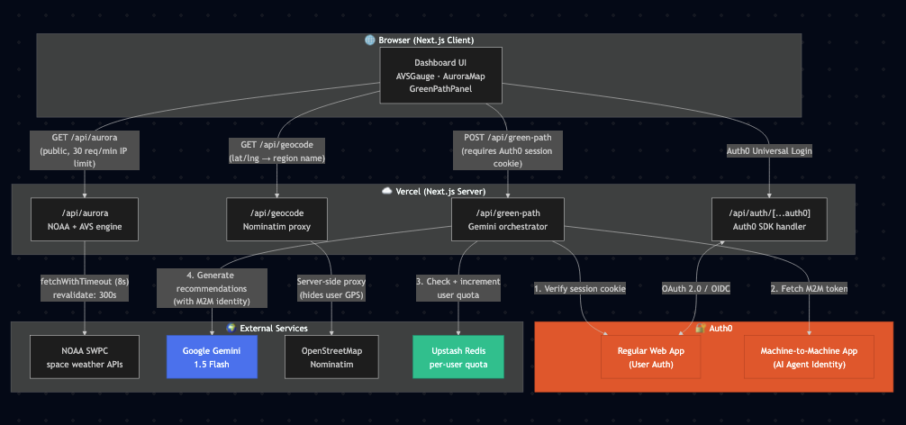

# AuroraPath 🌌

> **Sustainable Aurora Viewing — Earth Day Hackathon 2026**
>
> A real-time, carbon-optimized dashboard for aurora borealis sightings.
> Built for the [dev.to Earth Day Weekend Challenge](https://dev.to/challenges/weekend-2026-04-16).

[](https://vercel.com/new/clone?repository-url=https://github.com/klee1611/AuroraPath)

---

## 🌍 What Is AuroraPath?

AuroraPath connects people with Earth's most spectacular natural phenomenon — the aurora borealis — while promoting sustainable travel. Instead of jumping in a car and driving to a dark-sky spot, AuroraPath shows you the best eco-friendly routes: public transit, carpooling, and low-carbon options, each with real CO₂ savings so you can chase the lights and tread lightly on the planet.

**AuroraPath** combines live NOAA space weather data with Google Gemini AI to help you:

1. **Track real-time aurora activity** — Aurora Visibility Score (AVS), G/R/S-scale meters, solar wind speed
2. **See where auroras are visible** — Interactive map with latitude visibility bands that update with geomagnetic conditions
3. **Find sustainable viewing routes** — AI-generated "Green Path" recommendations with carbon savings, public transit options, and dark-sky ratings

---

## 🎬 Demo

<video src="https://github.com/klee1611/AuroraPath/raw/main/public/Aurora_Path_User_Guide.mp4" controls width="100%"></video>

> Can't see the video? [Download it here](https://github.com/klee1611/AuroraPath/raw/main/public/Aurora_Path_User_Guide.mp4).

---

## 🧬 Aurora Visibility Score (AVS)

An empirical model based on NOAA space weather indices:

```
AVS = (G-Scale/5 × 65) + (max(windSpeed - 300, 0)/500 × 25) + forecastBonus
```

| Score | Level | Meaning |
|-------|-------|---------|
| 80–100 | 🌌 Excellent | Visible at mid-latitudes (≥45°N) |
| 60–79 | ✨ High | Strong activity at high latitudes |
| 35–59 | 🌠 Moderate | Visible at polar regions (≥60°N) |
| 10–34 | 🌃 Low | Far northern regions only |
| 0–9 | 🌙 None | Quiet conditions |

---

## 🏗️ Architecture



The system uses a two-layer identity model:
- **Regular Web App** (Auth0) — authenticates end users via Universal Login
- **Machine-to-Machine App** (Auth0) — gives the Gemini AI agent a managed, auditable identity separate from any user

Key data flows:
- `GET /api/aurora` — public endpoint, NOAA ingestion + AVS computation, 30 req/min IP rate limit
- `GET /api/geocode` — server-side Nominatim proxy (hides user GPS coordinates from third parties)
- `POST /api/green-path` — requires Auth0 session cookie; verifies identity, checks/increments Upstash Redis quota, calls Gemini with M2M token

---

## 🔧 Tech Stack

| | |
|---|---|
| Framework | Next.js 14 (App Router) |
| Language | TypeScript |
| Styling | Tailwind CSS |
| Map | react-leaflet + Stadia Maps |
| Charts | Recharts |
| AI | Google Gemini 3.1 Flash |
| Auth | Auth0 (SPA + M2M) |
| Cache / Quota | Upstash Redis |
| Data | NOAA Space Weather Prediction Center |
| Deploy | Vercel |

---

## 🚀 Setup

### 1. Clone & Install

```bash
git clone https://github.com/klee1611/AuroraPath.git
cd AuroraPath
npm install
```

### 2. Configure Environment

```bash
cp .env.example .env.local
```

Fill in `.env.local`:

| Variable | Where to get it |
|----------|----------------|
| `AUTH0_SECRET` | Run: `openssl rand -hex 32` |
| `AUTH0_BASE_URL` | Your app URL (e.g. `http://localhost:3000`) |
| `AUTH0_ISSUER_BASE_URL` | Your Auth0 domain (e.g. `https://dev-xxx.auth0.com`) |
| `AUTH0_CLIENT_ID` | Auth0 → Applications → Regular Web App |
| `AUTH0_CLIENT_SECRET` | Auth0 → Applications → Regular Web App |
| `AUTH0_M2M_CLIENT_ID` | Auth0 → Applications → Machine to Machine |
| `AUTH0_M2M_CLIENT_SECRET` | Auth0 → Applications → Machine to Machine |
| `AUTH0_M2M_AUDIENCE` | `https://YOUR_DOMAIN.auth0.com/api/v2/` |
| `GEMINI_API_KEY` | [Google AI Studio](https://aistudio.google.com/app/apikey) |
| `UPSTASH_REDIS_REST_URL` | [Upstash console](https://console.upstash.com) → Redis → REST API |
| `UPSTASH_REDIS_REST_TOKEN` | [Upstash console](https://console.upstash.com) → Redis → REST API |
| `DAILY_GEMINI_LIMIT` | Max AI calls per user per day (default: `5`) |

> **Upstash is optional in development.** If not set, an in-memory fallback is used automatically.

### 3. Auth0 Setup

1. Create a **Regular Web Application** in Auth0
2. Set **Allowed Callback URLs**: `http://localhost:3000/api/auth/callback`
3. Set **Allowed Logout URLs**: `http://localhost:3000`
4. Create a **Machine to Machine** application and authorize the Management API

### 4. Run

```bash
npm run dev
```

Open [http://localhost:3000](http://localhost:3000)

---

## 📦 Deploy to Vercel

```bash
npx vercel --prod
```

Add all `.env.local` variables in Vercel → Project Settings → Environment Variables.

Update Auth0 callback/logout URLs to your Vercel domain.

---

*Built with 💚 for Earth Day 2026*
