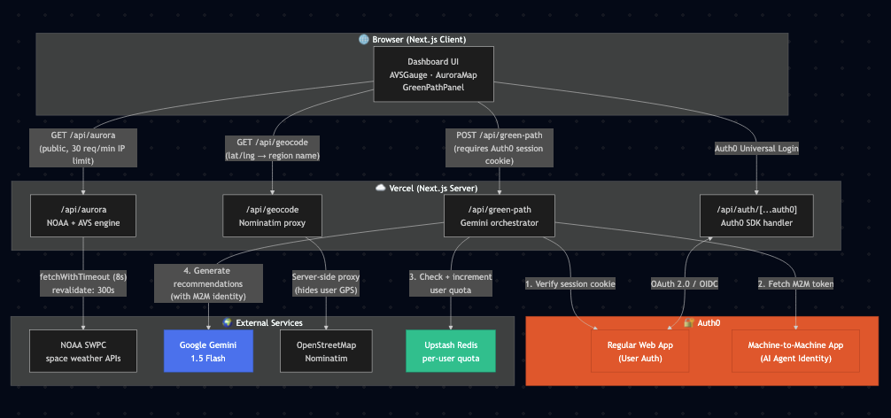

# AuroraPath 🌌

> **Sustainable Aurora Viewing — Earth Day Hackathon 2026**
>
> A real-time, carbon-optimized dashboard for aurora borealis sightings.
> Built for the [dev.to Earth Day Weekend Challenge](https://dev.to/challenges/weekend-2026-04-16).

[](https://vercel.com/new/clone?repository-url=https://github.com/klee1611/AuroraPath)

---

## 🌍 What Is AuroraPath?

AuroraPath connects people with Earth's most spectacular natural phenomenon — the aurora borealis — while promoting sustainable travel. Instead of jumping in a car and driving to a dark-sky spot, AuroraPath shows you the best eco-friendly routes: public transit, carpooling, and low-carbon options, each with real CO₂ savings so you can chase the lights and tread lightly on the planet.

**AuroraPath** combines live NOAA space weather data with Google Gemini AI to help you:

1. **Track real-time aurora activity** — Aurora Visibility Score (AVS), G/R/S-scale meters, solar wind speed
2. **See where auroras are visible** — Interactive map with latitude visibility bands that update with geomagnetic conditions
3. **Find sustainable viewing routes** — AI-generated "Green Path" recommendations with carbon savings, public transit options, and dark-sky ratings

---

## 🎬 Demo

<video src="https://github.com/klee1611/AuroraPath/raw/main/public/Aurora_Path_User_Guide.mp4" controls width="100%"></video>

> Can't see the video? [Download it here](https://github.com/klee1611/AuroraPath/raw/main/public/Aurora_Path_User_Guide.mp4).

---

## 🧬 Aurora Visibility Score (AVS)

The AVS separates two questions that determine whether you actually see an aurora:
**how much aurora is there**, and **does it reach you**.

```
AVS = activity × visibility

activity   = weighted mean of (hemispheric power, Newell coupling, Kp)   → 0–100
visibility = how far the auroral oval extends past your geomagnetic latitude → 0–1
```

Implemented in [`lib/vscore.ts`](lib/vscore.ts).

### Activity — how much aurora there is

| Driver | Weight | Source |
|--------|--------|--------|
| **OVATION Prime hemispheric power** (GW) | 0.45 | NOAA's own auroral precipitation model output — total energy deposited into the hemisphere |
| **Newell solar wind–magnetosphere coupling** | 0.30 | Computed live from propagated L1 solar wind |
| **Planetary K-index** (continuous 0–9) | 0.25 | Standard 3-hour planetary geomagnetic index |

Weights are **renormalised over whichever feeds respond**, so a NOAA outage degrades precision
instead of silently skewing the score.

The coupling term is the Newell coupling function — the rate at which magnetic flux is opened
at the magnetopause, and the quantity that drives OVATION Prime itself:

```
dΦ_MP/dt = v^(4/3) · B⊥^(2/3) · sin^(8/3)(θ_c / 2)
```

where `v` is solar wind speed, `B⊥ = √(By² + Bz²)` is the IMF perpendicular to the Sun–Earth
line, and `θ_c = arccos(Bz / B⊥)` is the clock angle, all in GSM coordinates. Northward IMF
gives `θ_c = 0` and therefore **zero** coupling; fully southward IMF gives maximal coupling.

### Visibility — whether it reaches you

Aurora position follows **geomagnetic**, not geographic, latitude. NOAA's rule: the oval's
equatorward edge sits at ~66° magnetic latitude at Kp 0 and moves equatorward ~2° per Kp level,
reaching 48° at Kp 9.

```
oval edge (°mlat) = 66 − 2 × Kp
```

Observer geomagnetic latitude comes from a centred-dipole transform about the WMM2025
geomagnetic north pole (80.85°N, 72.76°W). Full credit when you are poleward of the oval edge,
tapering across the ~9° (≈1000 km) band where the aurora sits on the northern horizon — NOAA
notes a clear northward view can catch aurora that far away — and falling off sharply beyond.

Why this matters: Reykjavík (64.2°N) is magnetically *further north* than Tromsø (69.7°N), and
Seattle and London sit at nearly the same geomagnetic latitude despite 4° of geographic
difference. Location is optional — without it the score reports activity strength only.

### Score bands

| Score | Level | Meaning |
|-------|-------|---------|
| 80–100 | 🌌 Excellent | Severe storm — visible well outside the usual auroral zone |
| 60–79 | ✨ High | Strong, active display where the oval reaches you |
| 35–59 | 🌠 Moderate | Solid display near or inside the oval |
| 10–34 | 🌃 Low | Faint, or the oval is sitting north of you |
| 0–9 | 🌙 None | Quiet, or far outside the oval's reach |

### Why the previous model was inaccurate

The earlier formula was `G-Scale/5 × 65 + wind bonus + forecast bonus`. Four problems:

1. **The G-scale is zero below Kp 5.** G1 *starts* at Kp 5, so ordinary Kp 3–4 aurora nights —
   the majority of viewable nights at high latitude — scored near zero. Using continuous Kp and
   hemispheric power fixes this. On a live Kp 2.3 / 25 GW night the old formula returned 8
   ("None") for Tromsø; the new one returns 34 ("Low"), which is what was actually happening.
2. **IMF Bz was ignored entirely** — the single most important driver. Fast solar wind with
   *northward* Bz produces almost no aurora, but the old wind term rewarded it anyway.
3. **No observer latitude**, so a G5 storm read identically in Texas and in Tromsø.
4. **A 24-hour forecast inflated the current score**, conflating "there may be aurora tomorrow"
   with "there is aurora now."

A separate bug compounded this: the solar wind feed
(`solar-wind/plasma-7-day.json`) had been **retired by NOAA and was returning 404**, so wind
speed was silently `null` and fell back to a hardcoded 400 km/s.

### Data sources

All from [NOAA SWPC](https://services.swpc.noaa.gov/), no API key required:

| Feed | Endpoint |
|------|----------|
| Hemispheric power | [`text/aurora-nowcast-hemi-power.txt`](https://services.swpc.noaa.gov/text/aurora-nowcast-hemi-power.txt) |
| Solar wind + IMF (propagated to the bow shock) | [`products/geospace/propagated-solar-wind-1-hour.json`](https://services.swpc.noaa.gov/products/geospace/propagated-solar-wind-1-hour.json) |
| Planetary K-index | [`products/noaa-planetary-k-index.json`](https://services.swpc.noaa.gov/products/noaa-planetary-k-index.json) |
| G/R/S scales + forecasts | [`products/noaa-scales.json`](https://services.swpc.noaa.gov/products/noaa-scales.json) |

### References

- Newell, P. T., Sotirelis, T., Liou, K., Meng, C.-I., & Rich, F. J. (2007). *A nearly universal
  solar wind–magnetosphere coupling function inferred from 10 magnetospheric state variables.*
  Journal of Geophysical Research: Space Physics, 112, A01206.
  [doi:10.1029/2006JA012015](https://doi.org/10.1029/2006JA012015) — the coupling function.
- Newell, P. T., Sotirelis, T., & Wing, S. (2014). *OVATION Prime-2013: Extension of auroral
  precipitation model to higher disturbance levels.* Space Weather, 12, 368–379.
  [doi:10.1002/2014SW001056](https://doi.org/10.1002/2014SW001056) — the model behind
  hemispheric power.
- NOAA SWPC, [*Tips on Viewing the Aurora*](https://www.spaceweather.gov/content/tips-viewing-aurora)
  — the Kp → geomagnetic latitude rule and the ~1000 km horizon reach.
- NOAA SWPC, [*Aurora – 30 Minute Forecast*](https://www.spaceweather.gov/products/aurora-30-minute-forecast)
  — OVATION Prime operational product and the hemispheric power index.
- AuroraWatch UK (Lancaster University),
  [*Ovation Aurora Forecast*](https://wp.lancs.ac.uk/aurorawatchuk/2017/03/07/ovation-aurora-forecast/)
  — interpretation of hemispheric power values (<20 GW little or none, 20–50 GW near the oval,
  >50 GW readily observable, 100+ GW major storm).
- NOAA NCEI, [*Wandering of the Geomagnetic Poles*](https://www.ncei.noaa.gov/products/wandering-geomagnetic-poles)
  — WMM2025 geomagnetic pole position used for the dipole transform.

---

## 🏗️ Architecture



The system uses a two-layer identity model:
- **Regular Web App** (Auth0) — authenticates end users via Universal Login
- **Machine-to-Machine App** (Auth0) — gives the Gemini AI agent a managed, auditable identity separate from any user

Key data flows:
- `GET /api/aurora` — public endpoint, NOAA ingestion + AVS computation, 30 req/min IP rate limit.
  Optional `?lat=&lng=` makes the score location-aware; coordinates are rounded to 0.1° by the
  client before being sent
- `GET /api/geocode` — server-side Nominatim proxy (hides user GPS coordinates from third parties)
- `POST /api/green-path` — requires Auth0 session cookie; verifies identity, checks/increments Upstash Redis quota, calls Gemini with M2M token

---

## 🔧 Tech Stack

| | |
|---|---|
| Framework | Next.js 14 (App Router) |
| Language | TypeScript |
| Styling | Tailwind CSS |
| Map | react-leaflet + Stadia Maps |
| Charts | Recharts |
| AI | Google Gemini 3.1 Flash |
| Auth | Auth0 (SPA + M2M) |
| Cache / Quota | Upstash Redis |
| Data | NOAA Space Weather Prediction Center |
| Deploy | Vercel |

---

## 🚀 Setup

### 1. Clone & Install

```bash
git clone https://github.com/klee1611/AuroraPath.git
cd AuroraPath
npm install
```

### 2. Configure Environment

```bash
cp .env.example .env.local
```

Fill in `.env.local`:

| Variable | Where to get it |
|----------|----------------|
| `AUTH0_SECRET` | Run: `openssl rand -hex 32` |
| `AUTH0_BASE_URL` | Your app URL (e.g. `http://localhost:3000`) |
| `AUTH0_ISSUER_BASE_URL` | Your Auth0 domain (e.g. `https://dev-xxx.auth0.com`) |
| `AUTH0_CLIENT_ID` | Auth0 → Applications → Regular Web App |
| `AUTH0_CLIENT_SECRET` | Auth0 → Applications → Regular Web App |
| `AUTH0_M2M_CLIENT_ID` | Auth0 → Applications → Machine to Machine |
| `AUTH0_M2M_CLIENT_SECRET` | Auth0 → Applications → Machine to Machine |
| `AUTH0_M2M_AUDIENCE` | `https://YOUR_DOMAIN.auth0.com/api/v2/` |
| `GEMINI_API_KEY` | [Google AI Studio](https://aistudio.google.com/app/apikey) |
| `UPSTASH_REDIS_REST_URL` | [Upstash console](https://console.upstash.com) → Redis → REST API |
| `UPSTASH_REDIS_REST_TOKEN` | [Upstash console](https://console.upstash.com) → Redis → REST API |
| `DAILY_GEMINI_LIMIT` | Max AI calls per user per day (default: `5`) |

> **Upstash is optional in development.** If not set, an in-memory fallback is used automatically.

### 3. Auth0 Setup

1. Create a **Regular Web Application** in Auth0
2. Set **Allowed Callback URLs**: `http://localhost:3000/api/auth/callback`
3. Set **Allowed Logout URLs**: `http://localhost:3000`
4. Create a **Machine to Machine** application and authorize the Management API

### 4. Run

```bash
npm run dev
```

Open [http://localhost:3000](http://localhost:3000)

---

## 📦 Deploy to Vercel

```bash
npx vercel --prod
```

Add all `.env.local` variables in Vercel → Project Settings → Environment Variables.

Update Auth0 callback/logout URLs to your Vercel domain.

---

*Built with 💚 for Earth Day 2026*
